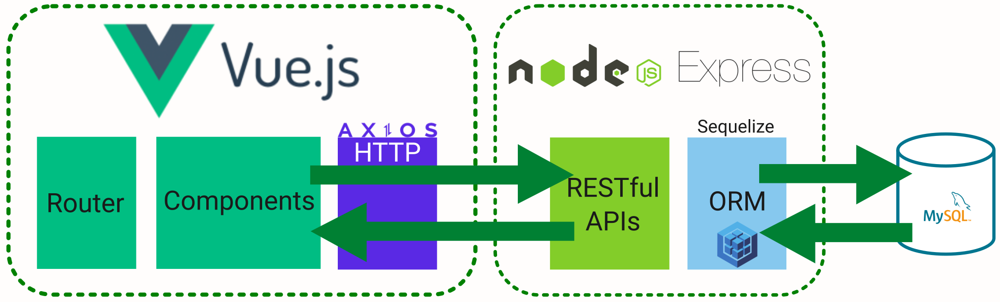

# 0n1Cla$$ Web Tech

Boilerplate Node.js Vue.js Express Sequelize MySQL Bootstrap

In questo progetto, mostrerò come costruire un'applicazione completa (full-stack Vue.js + Node.js + Express + MySQL) con esempi e CRUD.
Il server di back-end utilizza Node.js ed Express per le REST APIs mentre il front-end è un client router Vue con axios.

Le tecnologie che utilizzeremo sono indicate di seguito.

| Tech        | Version     | Layer       | Link        |
| ----------- | ----------- | ----------- | ----------- |
|Node.js      |18.9.0       |Backend      |<https://nodejs.org/en/about>|
|Vue.js       |3.2.39       |Frontend     |<https://vuejs.org>|
|axios        |0.27.2       |http client  |<https://axios-http.com>|
|Express      |4.18.1       |Frontend     |<https://expressjs.com>|
|Sequelize    |6            |ORM          |<https://sequelize.org>|
|TypeScript   |4.8.3        |JavaScript   |<https://www.typescriptlang.org>|
|MySQL        |8.0.30       |Database     |<https://www.mysql.com/it>||
|Font Awesome |6.2.0        |Icons        |<https://fontawesome.com>|
|HeidiSQL     |12.1         |DB interface |<https://www.heidisql.com>|
|VS Code      |1.71         |IDE          |<https://code.visualstudio.com>|
|Atom         |1.60.0       |Editor       |<https://atom.io>|
|Notepad++    |8.4.5        |Editor       |<https://notepad-plus-plus.org>|
|git          |2.37.3       |Source Ctrl  |<https://git-scm.com>|
|GitHub       |-            |Source Arc.  |<https://github.com>|
|NuxtJS       |2.15.8       |Vue Framework|<https://nuxtjs.org>|
|Volar        |0.40.13      |VS Code Ext  |<https://marketplace.visualstudio.com/items?itemName=Vue.volar>|
|Inkscape     |1.1          |Editor Graph |<https://inkscape.org/it>|
|paint.net    |4.3.12       |Editor Graph |<https://www.getpaint.net>|
|             |             |             |             |

Costruiremo un'applicazione web full-stack per pubblicare online dei tutorial dove:

- Il tutorial è descritto da id, titolo, descrizione e stato di pubblicazione;
- L'utente può creare, richiedere, aggiornare o cancellare dei tutorial;
- Sarà presente una barra di ricerca per trovare i tutorial per titolo.

In sintesi saranno realizzate delle pagine applicative per aggiungere un nuovo tutorial, elencare tutti i tutorial presenti, editare un tutorial esistente (cambiare lo stato di pubblicazione, cancellare il tutorial, aggiornare i dati), ricercare i tutorial per titolo.

## Architettura

L'architettura che utilizzeremo è la seguente:


- Node.js con Express espone le API REST e interagisce con il database MySQL utilizzando come ORM Sequelize;
- Vue Client invia richieste HTTP e recupera risposte HTTP utilizzando Axios, consuma dati sui componenti.
- Vue Router viene utilizzato per navigare tra le pagine.

## Start Up

Installazione di Node.js.

Installazione di Visual Studio Code.

Installazione di git.

Installazione di Notepad++.

Installazione di Inkscape.

Installazione di paint.net.

## Back-End (Node.js + Express)

### APIs

Di seguito l'elenco di API che esporremo:

| Metodi      | URLs                     | Azioni                   |
| ----------- | -----------              | ---------                |
|GET          |api/tutorials             |prendi tutti i tutorial   |
|GET          |api/tutorials/:id         |prendi tutorial per id    |
|POST         |api/tutorials             |aggiungi nuovo tutorial   |
|PUT          |api/tutorials/:id         |aggiorna tutorial per id  |
|DELETE       |api/tutorials/:id         |elimina tutorial per id   |
|DELETE       |api/tutorials             |elimina tutti i tutorial  |
|GET          |api/tutorials?title=[web] |trova tutti i tutorial il cui titolo contiene 'web'|
|             |                          |                          |

### Struttura del progetto

- db.config.js contiene i parametri di configurazione per la connessione a MySQL e Sequelize.
- Server Web Express in server.js dove configuriamo CORS, inizializziamo ed eseguiamo le API REST Express.
- Successivamente, aggiungiamo la configurazione per il database MySQL in models/index.js e configuriamo Sequelize data model in models/tutorial.model.js.
- I controller degli oggetti tutorial sono nella cartella controllers.
- In tutorial.routes.js ci sono le rotte per la gestione di tutte le operazioni CRUD.

## Implementazione

### Creazione del progetto su GitHub

Creiamo il progetto su GitHub e dopo scarichiamolo con Visual Studio Code.

### Creazione dell'applicazione Node.js

Come prima cosa creiamo la cartella 0n1classWebTech.

``` bash
> mkdir 0n1classWebTech
> cd 0n1classWebTech
```

Dopodiché inizializziamo l'applicazione Node.js creando il file package.json tramite il comando npm init:

``` text
npm init
name: (0n1classWebTech) 
version: (1.0.0) 
description: Boilerplate Node.js Vue.js Express Sequelize MySQL Bootstrap.
entry point: index.js
test command: 
git repository: 
keywords: nodejs, express, sequelize, mysql, rest, api
author: SLS
license: (ISC)

Is this ok? (yes) yes
```

Dobbiamo installare i moduli necessari: express, sequelize, mysql2 e body-parser. Di seguito i comandi per l'installazione dei moduli:

``` text
npm install express sequelize mysql2 body-parser cors –save
added 93 packages, and audited 94 packages in 12s

8 packages are looking for funding
  run `npm fund` for details

found 0 vulnerabilities
```

## Configurazione del web server Express
